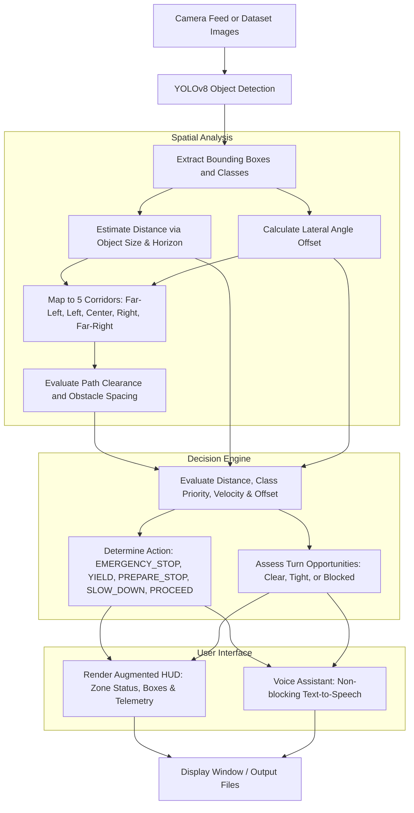

# Context-Aware Navigation Assistant

[](https://www.python.org/)
[](https://github.com/ultralytics/ultralytics)
[](https://opencv.org/)
[](#heads-up-display-hud)
[](#voice-guidance-system)

When navigating or driving forward, simply detecting objects in an image isn't enough. You need to know how far away an obstacle is, whether it sits directly in your path or off to the side, and whether you have room to steer left or right if something blocks your way.

This repository provides a context-aware navigation assistant built in Python. It combines real-time object detection (using YOLOv8) with geometric distance estimation, 5-zone spatial corridor analysis, and a rule-based decision engine. The system evaluates the road ahead, identifies immediate collision risks, checks if side paths are clear for turning, overlays a heads-up display (HUD) on the video feed, and announces spoken recommendations through an integrated voice assistant.

---

## Table of Contents

- [System Overview](#system-overview)
- [How It Works](#how-it-works)
- [Decision Logic and Actions](#decision-logic-and-actions)
- [Benchmark Results](#benchmark-results)
  - [Summary Statistics](#summary-statistics)
  - [Scene-by-Scene Breakdown](#scene-by-scene-breakdown)
  - [Case Studies](#case-studies)
- [Repository Structure](#repository-structure)
- [Setup and Installation](#setup-and-installation)
- [How to Run](#how-to-run)
  - [Command-Line Options](#1-command-line-options)
  - [Interactive Mode](#2-interactive-mode)
  - [Live Camera Keyboard Controls](#3-live-camera-keyboard-controls)
- [Object Priority and Safety Settings](#object-priority-and-safety-settings)
- [License and Credits](#license-and-credits)

---

## System Overview



---

## How It Works

1. **Object Detection**: We use a lightweight YOLOv8 nano model (`yolov8n.pt`) to detect key road entities in real time: cars, buses, trucks, pedestrians, motorcycles, bicycles, traffic lights, and stop signs.
2. **Monocular Distance Estimation**: Rather than requiring dedicated depth sensors or stereo cameras, distance is estimated using pinhole geometry. We combine known nominal physical heights for each object class (for example, 1.7 m for pedestrians, 1.5 m for cars, 3.2 m for buses) with the bounding box height, an effective focal parameter ($f = 700$), and vertical horizon perspective adjustments.
3. **5-Zone Corridor Segmentation**: The horizontal field of view is split into five functional angular zones:
   - **Far Left** ($-90^\circ \text{ to } -45^\circ$): Far peripheral hazards and sharp turn clearance.
   - **Left** ($-45^\circ \text{ to } -15^\circ$): Left turn opportunities and approaching cross-traffic.
   - **Center** ($-15^\circ \text{ to } +15^\circ$): The direct travel path ahead.
   - **Right** ($+15^\circ \text{ to } +45^\circ$): Right turn opportunities and roadside activity.
   - **Far Right** ($+45^\circ \text{ to } +90^\circ$): Far peripheral hazards and wide turns.
4. **Context-Aware Decision Engine**: The system doesn't rely solely on raw distance. It factors in object priority (a pedestrian or stop sign demands more caution than a distant car), detector confidence, current vehicle speed, and lateral position to determine an action and assign an urgency level.
5. **Turn Clearance Analysis**: Whenever an obstacle is in front or you need to slow down, the assistant scans the left and right zones to tell you whether turning is safe, tight, or blocked.
6. **Visual HUD and Audio Guidance**:
   - The video feed is augmented with color-coded bounding boxes (red for critical, orange for high urgency, yellow for moderate, green for low).
   - Top banners show the status of all five zones at a glance (green for clear, red for blocked).
   - A central banner displays the recommended action and rationale.
   - A bottom bar lists nearby obstacles and their relative corridors.
   - Spoken notifications keep the driver or user informed hands-free without flooding the audio channel.

---

## Decision Logic and Actions

The system categorizes situations into five primary navigation actions:

| Action | Condition | Goal |
| :--- | :--- | :--- |
| **`EMERGENCY_STOP`** | An obstacle is inside the emergency stop distance directly in the center path (e.g., a vehicle $\le 8\text{--}10\text{ m}$, pedestrian $\le 5\text{ m}$). | Halt immediately to prevent collision; check lateral corridors for an emergency escape route. |
| **`YIELD`** | A pedestrian or cyclist is in or entering the travel path at close range ($\le 25\text{ m}$). | Slow down smoothly and yield right-of-way. |
| **`PREPARE_STOP`** | A stop sign or traffic signal is detected ahead ($\le 30\text{--}50\text{ m}$) along the travel corridor. | Decelerate steadily toward the stop line. |
| **`SLOW_DOWN`** | Leading traffic, buses, or obstacles are detected ahead with closing distance. | Ease off the throttle to maintain a safe following buffer. |
| **`PROCEED_CAUTION`** | Objects are detected further down the road ($25\text{--}50\text{ m}$) but the immediate path is open. | Maintain speed while keeping an eye on forward traffic. |
| **`PROCEED`** | The center path is clear. | Continue forward at cruising speed. |

---

## Benchmark Results

The pipeline was benchmarked across 9 diverse street and intersection scenes featuring varied vehicle types, pedestrians, traffic controls, and speeds between 15 km/h and 50 km/h.

All generated output images and telemetry data are saved under the [`results/`](file:///home/harshal/GitHub/Context-Aware-Navigation-Assistant/results) directory.

### Summary Statistics

From [`results/summary_statistics.json`](file:///home/harshal/GitHub/Context-Aware-Navigation-Assistant/results/summary_statistics.json):

| Metric | Result |
| :--- | :--- |
| **Total Test Scenes** | 9 scenes |
| **Total Objects Detected** | 83 objects |
| **Average Objects per Scene** | 9.22 objects |
| **Critical Collision Situations Handled** | 3 (100% safety stop triggered) |
| **Safe Left Turn Corridors Identified** | 4 scenes |
| **Safe Right Turn Corridors Identified** | 6 scenes |

#### Action Breakdown
- `EMERGENCY_STOP`: 3 scenes (33.3%)
- `PREPARE_STOP`: 2 scenes (22.2%)
- `SLOW_DOWN`: 2 scenes (22.2%)
- `YIELD`: 1 scene (11.1%)
- `PROCEED`: 1 scene (11.1%)

#### Detected Objects Breakdown
- Pedestrians (`person`): 38
- Cars (`car`): 14
- Buses (`bus`): 11
- Motorcycles (`motorcycle`): 8
- Traffic lights (`traffic light`): 6
- Stop signs (`stop sign`): 5
- Trucks (`truck`): 1

---

### Scene-by-Scene Breakdown

| Image File | Speed | Detected Objects | Action | Urgency | Primary Directive | Turn Status | Output Frame |
| :--- | :---: | :--- | :---: | :---: | :--- | :--- | :---: |
| `000000000724.jpg` | 30 km/h | 2 Stop Signs | `PREPARE_STOP` | `HIGH` | PREPARE TO STOP - STOP SIGN at 14.7m | Left: Clear<br>Right: Clear | [View Frame](file:///home/harshal/GitHub/Context-Aware-Navigation-Assistant/results/enhanced_nav_000000000724.jpg) |
| `000000002006.jpg` | 40 km/h | 1 Bus, 2 Pedestrians | `EMERGENCY_STOP` | `CRITICAL` | STOP - BUS at 6.5m ahead | Left: Blocked (Person 9m)<br>Right: Clear | [View Frame](file:///home/harshal/GitHub/Context-Aware-Navigation-Assistant/results/enhanced_nav_000000002006.jpg) |
| `10277303256_a6a11a9d4b_z.jpg` | 50 km/h | 20 Objects (Motorcycles, Cars, Pedestrians) | `SLOW_DOWN` | `MODERATE` | REDUCE SPEED - MOTORCYCLE at 8.6m ahead | Left: Blocked (Person 11m)<br>Right: Blocked (Person 5m) | [View Frame](file:///home/harshal/GitHub/Context-Aware-Navigation-Assistant/results/enhanced_nav_10277303256_a6a11a9d4b_z.jpg) |
| `4236286875_05b2e96ec4_z.jpg` | 25 km/h | 12 Objects (Cars, Stop Signs, Signals) | `PREPARE_STOP` | `HIGH` | PREPARE TO STOP - STOP SIGN at 22.2m | Left: Blocked (Car 9m)<br>Right: Tight (19m) | [View Frame](file:///home/harshal/GitHub/Context-Aware-Navigation-Assistant/results/enhanced_nav_4236286875_05b2e96ec4_z.jpg) |
| `8965896602_c68fe611bd_z.jpg` | 35 km/h | 11 Objects (Buses, Cars, Pedestrians) | `SLOW_DOWN` | `MODERATE` | REDUCE SPEED - BUS at 18.6m ahead | Left: Blocked (Person 10m)<br>Right: Clear (35m) | [View Frame](file:///home/harshal/GitHub/Context-Aware-Navigation-Assistant/results/enhanced_nav_8965896602_c68fe611bd_z.jpg) |
| `7345527746_6b25ae7ac1_z.jpg` | 45 km/h | 8 Objects (Truck, Buses, Pedestrians) | `EMERGENCY_STOP` | `CRITICAL` | STOP - TRUCK at 6.7m ahead | Left: Blocked (Person 10m)<br>Right: Blocked (Bus 5m) | [View Frame](file:///home/harshal/GitHub/Context-Aware-Navigation-Assistant/results/enhanced_nav_7345527746_6b25ae7ac1_z.jpg) |
| `6022871891_a601326786_z.jpg` | 15 km/h | 16 Objects (11 Pedestrians, Cars, Signals) | `YIELD` | `HIGH` | SLOW DOWN - PERSON crossing at 8.1m | Left: Blocked (14m)<br>Right: Blocked (Person 8m) | [View Frame](file:///home/harshal/GitHub/Context-Aware-Navigation-Assistant/results/enhanced_nav_6022871891_a601326786_z.jpg) |
| `000000001268.jpg` | 40 km/h | 4 Pedestrians | `PROCEED` | `NONE` | CONTINUE STRAIGHT - Path clear | Left: Tight (16m)<br>Right: Blocked (Person 5m) | [View Frame](file:///home/harshal/GitHub/Context-Aware-Navigation-Assistant/results/enhanced_nav_000000001268.jpg) |
| `000000001584.jpg` | 30 km/h | 7 Objects (3 Buses, 4 Pedestrians) | `EMERGENCY_STOP` | `CRITICAL` | STOP - BUS at 5.0m ahead | Left: Tight (18m)<br>Right: Tight (26m) | [View Frame](file:///home/harshal/GitHub/Context-Aware-Navigation-Assistant/results/enhanced_nav_000000001584.jpg) |

---

### Case Studies

- **Immediate Collision Avoidance (`000000002006.jpg` and `7345527746_6b25ae7ac1_z.jpg`)**:
  - In `000000002006.jpg`, a bus is stationary 6.5 m ahead while the vehicle travels at 40 km/h. The engine issues an `EMERGENCY_STOP` alert. At the same time, it notes that while pedestrians block the left side at 9 m, the right lane is clear, giving the driver an immediate safe lane-change option.
  - In `7345527746_6b25ae7ac1_z.jpg`, a large truck is stopped 6.7 m directly in front. Because both the left corridor (pedestrian at 10 m) and the right corridor (bus at 5 m) are blocked, the system warns that neither turn is safe, indicating that braking in a straight line is the only viable option.

- **Vulnerable Road User Protection (`6022871891_a601326786_z.jpg`)**:
  - In a crowded street scene with 11 pedestrians, a person crossing directly into the vehicle's path at 8.1 m triggers an immediate `YIELD` command, advising the driver to decelerate and give way.

- **Traffic Control Compliance (`000000000724.jpg` and `4236286875_05b2e96ec4_z.jpg`)**:
  - In `000000000724.jpg`, a stop sign detected 14.7 m away initiates a `PREPARE_STOP` recommendation. The assistant checks the crossway and confirms that both the left and right approaches are wide open (> 30 m clearance), confirming a clear path through the junction after coming to a full stop.

---

## Repository Structure

```
Context-Aware-Navigation-Assistant/
├── .gitignore                    # Ignores virtual environments, caches, and temp files
├── requirements.txt              # Project dependencies
├── README.md                     # Project documentation
├── yolov8n.pt                    # Pretrained YOLOv8 nano model
│
├── main.py                       # Unified entry point (CLI arguments & interactive menu)
├── test.py                       # Camera and dataset test runner (without voice)
├── test2.py                      # Camera and dataset test runner (with voice guidance)
│
├── src/                          # Core modular package
│   ├── __init__.py               # Package exports
│   ├── navigation_system.py      # Master navigation pipeline coordinator
│   ├── spatial_zones.py          # 5-zone angular segmentation and distance estimation
│   ├── decision_engine.py        # Rule-based decision matrix and risk scoring
│   ├── visualizer.py             # HUD renderer, zone indicators, and telemetry overlay
│   ├── voice.py                  # Thread-safe text-to-speech audio assistant
│   └── downloader.py             # Utility to download evaluation test images
│
├── dataset/                      # Test dataset
│   ├── images/                   # Sample street imagery for batch benchmarks
│   ├── PNGImages/                # Ground truth frames
│   ├── PedMasks/                 # Pedestrian segmentation masks
│   └── Annotation/               # Object bounding box annotations
│
├── results/                      # Generated evaluation outputs
│   ├── enhanced_nav_*.jpg        # Annotated output frames with full HUD overlay
│   ├── enhanced_navigation_report.json # Detailed per-frame telemetry and instructions
│   └── summary_statistics.json   # Aggregated dataset statistics
│
└── camera_results/               # Destination folder for saved webcam captures
    └── .gitkeep
```

---

## Setup and Installation

### Prerequisites
- Python 3.10, 3.11, or 3.12
- An active webcam (if running live camera mode)
- An audio output device (speakers or headphones, if voice guidance is enabled)

### Step 1: Clone the Repository
```bash
git clone https://github.com/HarshalKolhe02/Context-Aware-Navigation-Assistant.git
cd Context-Aware-Navigation-Assistant
```

### Step 2: Create a Virtual Environment
```bash
python3 -m venv venv
source venv/bin/activate
# On Windows command prompt: venv\Scripts\activate
```

### Step 3: Install Required Packages
```bash
pip install --upgrade pip
pip install -r requirements.txt
```

---

## How to Run

### 1. Command-Line Options

You can run [`main.py`](file:///home/harshal/GitHub/Context-Aware-Navigation-Assistant/main.py) directly with command-line flags:

```bash
# Process the benchmark dataset and write results to results/
python3 main.py --mode dataset

# Run live real-time camera feed with voice guidance
python3 main.py --mode camera --camera-id 0

# Run live camera feed silently (HUD only, no audio)
python3 main.py --mode camera --no-voice

# Process dataset first, then open camera feed
python3 main.py --mode both

# View all options
python3 main.py --help
```

### 2. Interactive Mode

If you run `main.py` without arguments, it opens a clean interactive menu:
```bash
python3 main.py
```
```
SELECT PROCESSING MODE:
   1. Real-time Camera Feed (with voice)
   2. Process Downloaded Dataset
   3. Both (Camera + Dataset)
   4. Exit

Enter your choice (1-4):
```

### 3. Live Camera Keyboard Controls

When running live camera mode, you can control the feed directly from the OpenCV window:

| Key | Action |
| :---: | :--- |
| `q` | Quit camera stream and close window |
| `s` | Save current HUD frame to `camera_results/camera_capture_<timestamp>.jpg` |
| `p` | Print current instruction and detected obstacles to the terminal |
| `v` | Repeat or force immediate spoken announcement of the current directive |

---

## Object Priority and Safety Settings

Object thresholds, priorities, and caution margins are defined in `DEFAULT_NAV_OBJECTS` inside [`src/navigation_system.py`](file:///home/harshal/GitHub/Context-Aware-Navigation-Assistant/src/navigation_system.py):

| Object Class | Category | Priority (1--10) | Emergency Stop Distance | Caution Distance |
| :--- | :---: | :---: | :---: | :---: |
| **`person`** | Pedestrian | 10 | 5 m | 35 m |
| **`traffic light`** | Traffic Signal | 10 | 15 m | 50 m |
| **`stop sign`** | Traffic Signal | 10 | 10 m | 30 m |
| **`truck`** | Heavy Vehicle | 8 | 10 m | 30 m |
| **`bus`** | Heavy Vehicle | 8 | 10 m | 30 m |
| **`car`** | Passenger Car | 8 | 8 m | 25 m |
| **`motorcycle`** | Single-Track Vehicle | 7 | 7 m | 20 m |
| **`bicycle`** | Single-Track Vehicle | 7 | 6 m | 20 m |

You can customize these distances and priorities to match different vehicle types, sensor mount heights, or operating speeds.

---

## License and Credits

- **YOLOv8**: Object detection powered by [Ultralytics](https://github.com/ultralytics/ultralytics).
- **Computer Vision**: Frame processing and HUD graphics handled by [OpenCV](https://opencv.org/).
- **Evaluation Imagery**: Benchmark scenes drawn from the Penn-Fudan Pedestrian Database and MS-COCO/Flickr Traffic collections.
